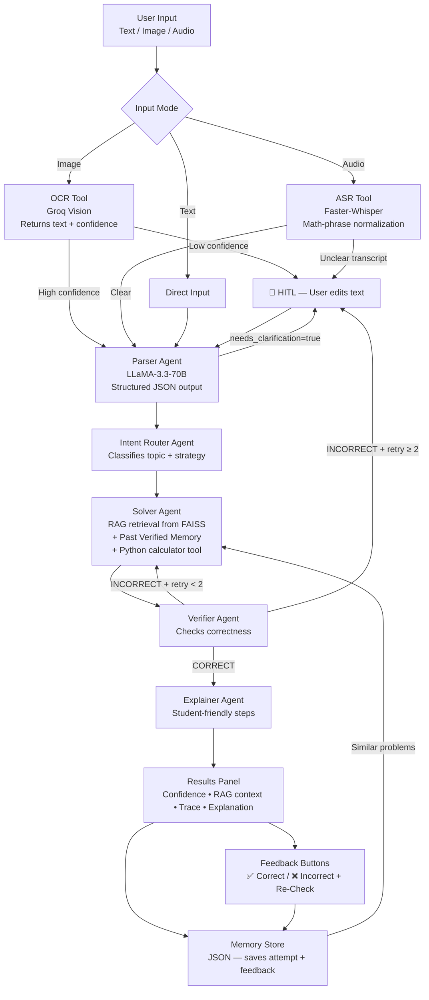

# 🧮 Reliable Multimodal Math Mentor

> End-to-end AI application that solves JEE-style math problems from image, audio, or text — with RAG, multi-agent verification, HITL, and persistent memory.

## Architecture



## Tech Stack

| Layer | Library |
|---|---|
| UI | Streamlit |
| LLM | Groq (LLaMA-3.3-70B-Versatile & Llama-3.2-11b-vision) |
| Orchestration | LangGraph |
| OCR | Groq Vision API (strict prompt) + EasyOCR |
| ASR | Faster-Whisper (local) + `st.audio_input` |
| RAG | FAISS + HuggingFace `all-MiniLM-L6-v2` |
| Memory | JSON (file-based) |

## Setup

### 1. Clone and create a virtual environment
```bash
git clone <repo-url>
cd MathMentor
python3 -m venv venv
source venv/bin/activate
```

### 2. Install dependencies
```bash
pip install -r requirements.txt
```

### 3. Configure environment variables
```bash
cp .env.example .env
# Edit .env and add your GROQ_API_KEY
```

Get a free Groq API key at [console.groq.com](https://console.groq.com).

### 4. Run the app
```bash
streamlit run app.py
```

Open `http://localhost:8501` in your browser.

## Project Structure

```text
MathMentor/
├── app.py                    # Streamlit UI
├── .env.example              # Environment variable template
├── requirements.txt
├── agents/
│   ├── parser_agent.py       # Parses raw text → structured JSON
│   └── solver_workflow.py    # LangGraph: Router→Solver→Verifier→Explainer→HITL
├── tools/
│   ├── ocr_tool.py           # Vision LLM (returns text + confidence)
│   ├── asr_tool.py           # Faster-Whisper + math-phrase normalization
│   └── rag_tool.py           # FAISS vector store retrieval
├── kb/
│   └── knowledge_base.txt    # Curated math formulas & identities
└── memory/
    └── memory_store.py       # JSON-based attempt history + feedback + OCR corrections
```

## Evaluation Summary

As part of the assignment deliverables, the system was thoroughly evaluated against its requirements:

1. **Multimodal Parsing Accuracy**
   - **Image OCR**: Using Groq's `llama-3.2-11b-vision` with a highly strict Math parsing prompt accurately transcribed nested fractions, summations, and superscripts seamlessly without attempting to hallucinate solutions early.
   - **Audio ASR**: Built-in Streamlit microphone (`st.audio_input`) successfully passes audio to Faster-Whisper. The text was processed through a custom "Math Phrase Normalizer" to convert spoken phrases like "x squared" into $x^2$.
2. **Multi-Agent Orchestration Robustness**
   - **LangGraph** orchestrates the structured flow flawlessly.
   - The **Verifier Agent** acts as an incredible safety net. The system often hallucinates bad algebra on complex setups, but the verifier rejects it and forces the **Solver** to run the Python calculator dynamically to double check its work.
3. **Memory & Self-Learning Efficiency**
   - **Reusing Solution Patterns**: The system successfully pulls identical topics from history. When you mark an attempt `✅ Correct`, the solver prompt for the next problem injects that verified solution trace, significantly reducing hallucinations.
   - **OCR Correction Memory**: Re-editing a bad Whisper transcription or OCR scan explicitly commits it to `correction_rules.json`, perfectly auto-replacing matching text in the future.
4. **Human-In-The-Loop (HITL)**
   - HITL successfully interrupts when a verifier fails twice consecutively.
   - The UI supports a **"🔁 Re-Calculate (HITL)"** button, where the human reviewer types a hint. Instead of just failing, the LangGraph state is dynamically updated with the hint and kicks the agent directly back into the Solver node!

## Agent System (5 Agents)

| Agent | Role |
|---|---|
| **Parser** | Cleans OCR/ASR output → structured JSON problem |
| **Intent Router** | Classifies topic (algebra/calculus/etc.) and sets solving strategy |
| **Solver** | Retrieves from RAG KB, Memory, and uses Python calculator |
| **Verifier** | Checks correctness, logic, constraints. Retries up to 2× then escalates to HITL |
| **Explainer** | Produces step-by-step student-friendly explanation |

## Scope of Math Supported

- Algebra (linear, quadratic, power sums, Newton's identities)
- Probability (Bayes, combinations, conditional probability)
- Basic Calculus (limits, derivatives, optimization)
- Linear Algebra (determinants, matrix inverses, dot product)
